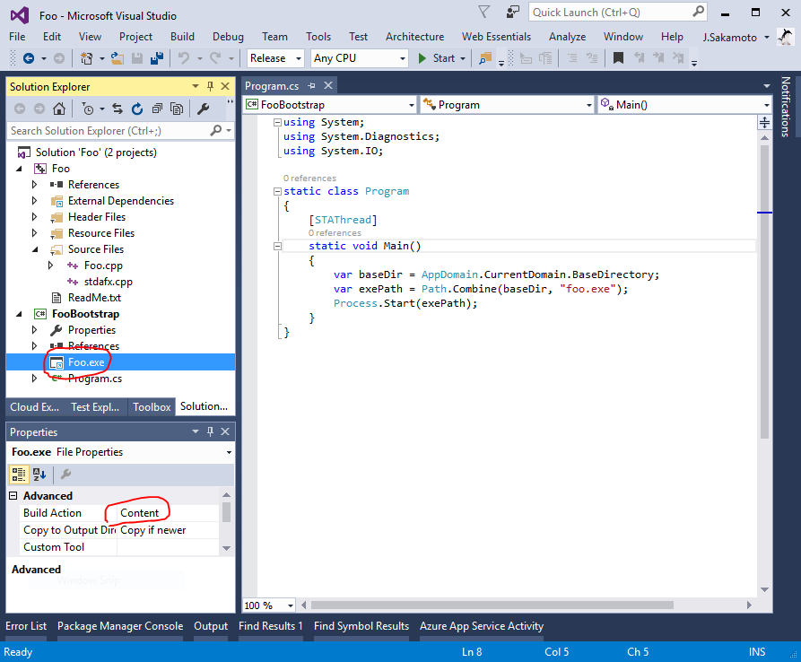

# Sample Code - How to deploy Win32 native application as "ClickOnce" / サンプルコード - Win32 ネイティブアプリを "ClickOnce" で配布する方法

If you want to deploy Win32 native application "Foo.exe" as ClickOnce, but ClickOnce technology suppot only .NET managed application, so you can do it follow step.

1. Add new C# Windows Forms project "FooBootstrap" that only lauch "Foo.exe" to Visual Studio solution.
2. Add "Foo.exe" to "FooBootstrap" project as existing linked item.
3. Change "Build Action" property of project item "Foo.exe" set to "Content".
4. Publish "FooBootstrap" as ClickOnce application, then the application package contains "Foo.exe".

Win32 ネイティブアプリである "Foo.exe" を ClickOnce で配布したい場合、しかし ClickOnce は .NET マネージドアプリのみをサポートしていますが、そのため以下の手順で実現できます。

1. "Foo.exe" を起動するだけの C# Windows フォームズプロジェクト "FooBootstrap" を Visual Studio ソリューションに追加します。
2. "FooBootstrap" プロジェクトに "Foo.exe" をリンクアイテムとして追加します。
3. プロジェクトアイテム "Foo.exe" の "ビルドアクション" プロパティを "コンテンツ" に設定します。
4. "FooBootstrap" を ClickOnce アプリとして発行します、するとそのアプリケーションパッケージに "Foo.exe" も収録されます。

